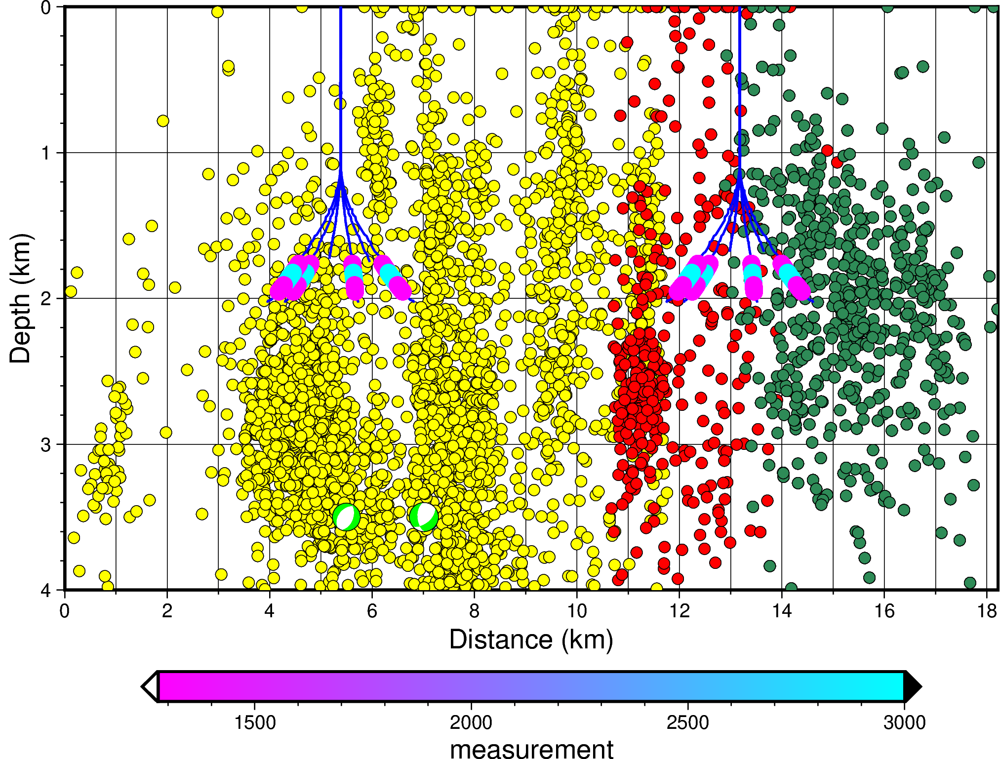

  


# Visualize seismicity through high-resolution maps and profiles.
  
  


# Installation

## conda
```bash
conda create --name eqviewer --channel=conda-forge pygmt geopandas openpyxl obspy ipykernel python=3.10
conda activate eqviewer
```


# Examples

I recommend it one step at a time. It will not take you so long.


| Examples |  |
|---|---|
| 1_shape| [](https://colab.research.google.com/github/ecastillot/EQViewer/blob/master/examples/1_shape.ipynb) |
| 2_stations| [](https://colab.research.google.com/github/ecastillot/EQViewer/blob/master/examples/2_stations.ipynb) |
| 3_catalog| [](https://colab.research.google.com/github/ecastillot/EQViewer/blob/master/examples/3_catalog.ipynb) |
| 4_well| [](https://colab.research.google.com/github/ecastillot/EQViewer/blob/master/examples/4_well.ipynb) |
| 5_fm| [](https://colab.research.google.com/github/ecastillot/EQViewer/blob/master/examples/5_fm.ipynb) |
| 6_profile| [](https://colab.research.google.com/github/ecastillot/EQViewer/blob/master/examples/6_profile.ipynb) |
| 7_viewer| [](https://colab.research.google.com/github/ecastillot/EQViewer/blob/master/examples/7_viewer.ipynb) |

